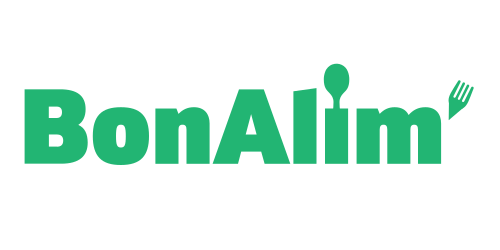

  

___

🍅 Your personal food advisor 🥦

___

**BonAlim'** is a free, open source and easy to use personal food advisor. It takes into account your food preferences, your needs, as well as your health.

  

## ✨ Features

 - [x] Salad recipe generation
 - [ ] Multiple recipes generation
 - [ ] Hot meal generation
 - [ ] Consideration of food preferences
 - [ ] Taking into account the nutritional recommendations of the WHO

## Getting started

⏳ Comming soon... 

## Contributing

Heeey! I am very happy to know that you are considering contributing to **BonAlim'** ! If you think anything is missing or could be improved, please open the issues and fill in your suggestions or requests. If you want to make this project grow, I will be happy to have your help!

## 💌 Contact

Feel free to contact me about any questions you may have:
* At [btte.rudy@gmail.com](mailto:btte.rudy@gmail.com)
* By opening an issue.

BonAlim' is developed by [Rudy Boutte](https://github.com/boutterudy), a young passionate developer. Any suggestion or feedback is highly appreciated. Thank you for your support!
